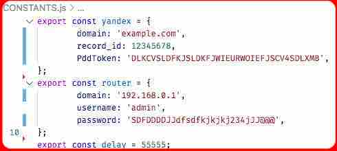

# connect-yandex-ddns
dynamic domain name service
## куплВордс
*Динамический сервис доменных имён. Сервис обновляет белый IP и больше ничего не умеет. Захардкожен под ZTE. [PR on GH](https://opensource.guide/how-to-contribute/)*, если будет другой
## хауИтВоркс
Сервис логится пупитиром маршрутизатору на морду и хватает прилетевшие кукисы. Дальше, с помощью нодовского хттп, с установленным интервалом, с морды грепится айпишник и сравнивается с прежним. Если обновился, то постом обновляется DNS в яндыксе. Если где-нибудь случается сбой (любой), то сервис удваивает интервал и бесперебойно работает дальше, до тех пор, пока сбой сам собой не разрешится - это удобно. Как грится, "комп врубил и забыл". Бенчмарки не замерялись, но тк пупитир мгновенно умирает и без нужды больше не используется, сервис не прожорливее курла с кроном, ВМ расходует память без утечек.
## хауТуЮз
- для установки, пройди-проехай в любимую папку, например так: ```cd ./desktop```
- и загрузи туда эту репу: **YANDEX-CONNECT-DDNS**
- по образцу жпгхи, отредактируй константу **router**, **delay** и **[yandex](yandex.ru/dev/connect/directory/api/concepts/domains/dns-records-via-pdd.html)** файла: ```./constants/CONSTANTS.js```
- дальше: ```npm install```
- и так: ```npm start```. 
###### *Чтобы не маяться с ручным пуском после каждой перезагрузки, рассмотри, установку **docker** или установку любого npm-модуля **pm2**, **forever** и подобных…*
###### bash команда ```pkill node``` удаляет все текущие node.js приложения
## жпГха


## каКаяТолиЦензия
Всё это хочется перевести на все языки, больше уделить внимание архитектуре, бейджам, тестированиям, и с приростом таланта, своевременным улучшениям, …, патентованиям, **[лицензированиям](./LICENSE)**, …но жизнь одна. Поэтому, без поводов, не предвидится просиживаний штанов за тем, что и так неплохо работает. Доработки отложены до лучших времён. Сервисом пользуемся и мы, и если обнаружим ошибку, то починим.
## какаЯтоПодпись
Прославься @hacking-logbook, @bchycada, @drawing-logbook, @dublb, @keeping-logbook 💚
